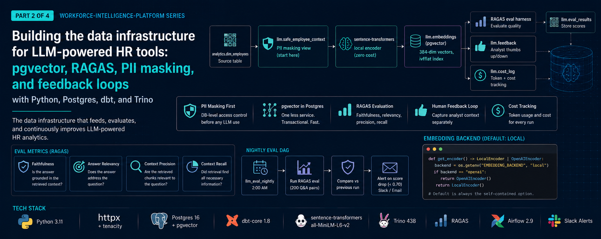

# workforce-intelligence-platform-llm-eval — LLM evaluation data infrastructure

Part 2 of 4 in the [workforce-intelligence-platform](../README.md).

Builds the data foundation for AI-powered People Analytics tooling:
embedding store, eval harness, PII masking views, feedback loop, and cost tracking.

---

## Architecture

```
 analytics.dim_employees (from ingestion)
         │
         ▼
  llm.safe_employee_context   ← PII masking view (salary, perf excluded)
         │
         ▼
  LocalEncoder (sentence-transformers)
  OR OpenAIEncoder (text-embedding-3-small)
         │
         ▼
  llm.embeddings (pgvector, 384-dim, ivfflat index)
         │
         ├──────────────────────────────────────┐
         ▼                                      ▼
  Q&A eval dataset (200 pairs)         Similarity search
         │                              (top-k retrieval)
         ▼                                      │
  RAGAS eval harness ◄───────────────────────────┘
         │
         ├── llm.eval_results (per-question scores)
         ├── llm.cost_log     (token + cost tracking)
         └── llm.feedback     (analyst thumbs up/down)
                  │
                  ▼
         Airflow DAGs: embedding_refresh (triggered) + nightly_eval (2am)
```

---

## Tech stack

| Concern | Technology |
|---|---|
| Vector DB | pgvector on Postgres 16 (`pgvector/pgvector:pg16`) |
| Embeddings | sentence-transformers (local) / OpenAI text-embedding-3-small |
| Eval framework | RAGAS 0.1.9 |
| Data validation | Pydantic v2 |
| Orchestration | Apache Airflow 2.9 |
| Testing | pytest + testcontainers |

---

## Setup

### Prerequisites

The shared Postgres (with pgvector) and the `analytics.dim_employees` table must exist
first — the masking view reads from it. From the repo root:

```bash
make infra-up         # Postgres (pgvector/pgvector:pg16) + Trino + Airflow
make ingestion-setup  # seed synthetic HR data
make ingestion-dbt    # build analytics.dim_employees
```

The `llm` schema and its tables are created on first DB init by
`docker/init_llm_schema.sql` (mounted as `02_llm.sql` in the shared compose).

### This module

```bash
cd 2-llm-eval
make setup         # install deps → create masking views → embed safe context into pgvector
make eval          # generate Q&A pairs → run RAGAS eval → write results + cost log
```

`make setup` runs `src.pipeline.setup`: it applies the PII masking views, verifies they
expose no forbidden columns, then embeds every `safe_employee_context` row into
`llm.embeddings`. The default `local` embedding backend runs fully offline.

> **`make eval` needs an LLM judge.** RAGAS computes its metrics with an LLM (and embedding)
> judge — by default OpenAI — so `make eval` requires `OPENAI_API_KEY` to be set, or a custom
> `evaluator` injected into `run_eval()`. The embedding and similarity-search paths
> (`make setup` / `make embed`) need no API key.

### Make targets

| Target | What it does |
|---|---|
| `make install` | Install the package + dev dependencies |
| `make setup` | Install, apply masking views, embed safe context |
| `make embed` | Re-embed `safe_employee_context` into pgvector |
| `make eval` | Run the RAGAS eval (needs `OPENAI_API_KEY`) |
| `make test-unit` | Unit tests + coverage (no infra required) |
| `make test-integration` | Integration tests (requires Docker / testcontainers) |
| `make test` | Unit + integration tests |
| `make lint` | Ruff lint over `src/` + `tests/` |
| `make clean` | Remove caches + coverage artifacts |

Unit tests mock the heavy ML/DB dependencies and run offline; the integration tests spin up
a real `pgvector/pgvector:pg16` container via testcontainers (Docker required), and the
local-encoder integration test is skipped unless `sentence-transformers` is installed.

---

## Data readiness for AI

The `llm.safe_employee_context` view is the only approved data source for LLM context windows.
It explicitly excludes `salary`, `performance_rating`, and raw `manager_id` before data
reaches any embedding or completion pipeline. This implements the principle of least privilege
for AI systems: the model sees only what it needs to answer workforce questions.

The `llm.feedback` table captures analyst corrections and thumbs-down ratings, creating a
human-in-the-loop feedback loop that can drive future fine-tuning or prompt improvement.

---

## Eval metrics

| Metric | What it measures |
|---|---|
| `faithfulness` | Is the generated answer grounded in the retrieved context? |
| `answer_relevancy` | Does the answer actually address the question? |
| `context_precision` | Are the retrieved chunks relevant to the question? |
| `context_recall` | Did retrieval find all necessary information? |

Target thresholds: all metrics ≥ 0.70. Airflow alerts fire below this threshold.

---

## Cost tracking

Every embedding and eval run writes a row to `llm.cost_log` (the local backend records
`cost_usd = 0`, so the offline default is free to run while still producing an audit trail).
Spend by run type over the last 30 days:

```sql
SELECT run_type,
       COUNT(*)              AS runs,
       SUM(embedding_count)  AS embeddings,
       SUM(input_tokens)     AS input_tokens,
       SUM(cost_usd)         AS total_cost_usd
FROM llm.cost_log
WHERE run_at > NOW() - INTERVAL '30 days'
GROUP BY run_type
ORDER BY total_cost_usd DESC;
```

Switching to `EMBEDDING_BACKEND=openai` (or running `make eval` against OpenAI) starts
populating real token counts and `cost_usd`, so the same query becomes a live cost dashboard.

---

## Design decisions

**sentence-transformers over OpenAI by default.** The `all-MiniLM-L6-v2` model runs locally,
costs nothing, has no API dependency, and produces 384-dimensional embeddings that fit comfortably
in a pgvector ivfflat index. OpenAI is available as an opt-in via `EMBEDDING_BACKEND=openai`
for production scenarios where quality matters more than cost.

**RAGAS over custom eval.** RAGAS provides standardised, reproducible metrics with published
benchmarks. Rolling your own eval framework is a maintenance liability — RAGAS scores are
comparable across model versions and meaningful to non-engineers reviewing the eval dashboard.

**Feedback separate from eval_results.** Eval results measure model quality against ground truth.
Feedback measures human preference. These are different signals and should be queryable
independently — a model can score high on faithfulness but still get thumbs-down from analysts
who find the phrasing unhelpful.
